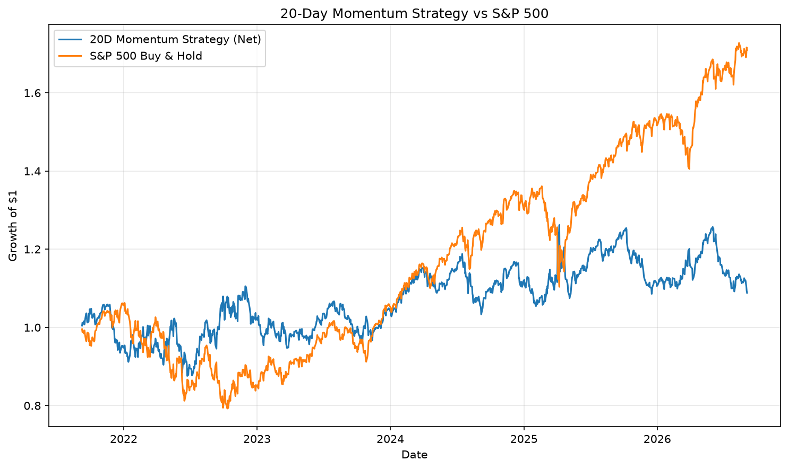

# Cross-Asset Quant Market Monitor

A Python-based quantitative market monitoring tool computing key market indicators across equity, volatility and FX markets.

## Objective

The project provides a simple cross-asset quantitative framework for analyzing market dynamics using historical price data.

It currently computes four indicators:

- Daily log returns
- 20-day momentum
- 20-day annualized realized volatility
- Z-score of daily returns

The project is designed as an introductory quantitative framework that can be progressively extended toward systematic signal generation and backtesting.

## Markets Covered

| Asset Class | Market |
|---|---|
| Equity | S&P 500 |
| Equity | Euro Stoxx 50 |
| Volatility | VIX |
| FX | EUR/USD |

## Quantitative Indicators

### 1D Log Return

Measures the continuously compounded daily return:

`r(t) = ln(P(t) / P(t-1))`

### 20D Momentum

Measures the price performance over the previous 20 trading days:

`Momentum(20D) = P(t) / P(t-20) - 1`

### 20D Realized Volatility

Measures the annualized standard deviation of daily log returns over a 20-day rolling window:

`Vol(20D) = std(r) × sqrt(252)`

### Z-Score

Measures how unusual the latest daily return is relative to its recent 20-day distribution:

`Z = (r(t) - mean(r)) / std(r)`

## Example Output

```text
Asset              1D Ret    20D Mom    20D Vol       Z
---------------------------------------------------------
S&P 500            -0.38%     -0.50%      8.30%   -0.67
Euro Stoxx 50       0.16%     -2.01%      8.07%    0.52
VIX                  1.46%     -2.48%     78.44%    0.32
EUR/USD              0.31%      0.84%      4.37%    0.97
## Backtest

A simple 20-day momentum strategy is tested on the S&P 500 over a 5-year period.

The strategy uses the following rule:

- Long exposure when 20-day momentum is positive
- Short exposure when 20-day momentum is negative

The signal is shifted by one trading day to avoid look-ahead bias.

### Performance Metrics

Current backtest results:

| Metric | Result |
|---|---:|
| Annualized Return | 5.21% |
| Annualized Volatility | 17.06% |
| Sharpe Ratio | 0.31 |
| Maximum Drawdown | -15.35% |
| Hit Ratio | 51.59% |

### Strategy vs Benchmark



The strategy is compared against a passive S&P 500 Buy & Hold benchmark.

The objective is not to optimize performance, but to illustrate a simple quantitative research workflow:

`Signal → Backtest → Risk Metrics → Benchmark Comparison`
